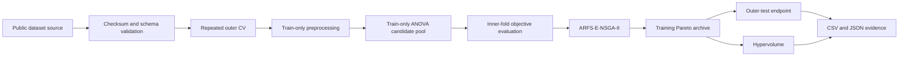

# ARFS-E-NSGA-II

[](https://github.com/kaiju123456x-gif/ARFS-E-NSGA-II/actions/workflows/ci.yml)

Official reproducibility repository for **Adaptive Redundancy-Aware Feature Selection with Enhanced Evolutionary Search Based on NSGA-II**.

This repository keeps the implementation, experiment configurations, public-data access workflow, provenance checks, tests, and result-audit tools in one location. It supports independent verification of the proposed ARFS-E-NSGA-II method and its eight component combinations.

## Repository contents

| Path | Purpose |
|---|---|
| `src/arfs_ensga2/` | ARFS-E-NSGA-II, objectives, initialization, nested evaluation, data preparation, and auditing |
| `configs/` | Exact paper and smoke-test configurations |
| `data/` | Dataset inventory, stable source identifiers, checksums, and automated preparation instructions |
| `tests/` | Unit and integration tests |
| `.github/workflows/ci.yml` | Automated tests and an end-to-end reproducibility smoke run |
| `REPRODUCIBILITY.md` | Clean-environment protocol for reproducing the experiments |

Raw third-party files are not relicensed by this repository. The data commands retrieve the fixed public sources, validate their identities, and generate the analysis-ready matrices locally. See [`data/README.md`](data/README.md) and [`data/dataset_manifest.csv`](data/dataset_manifest.csv).

## Method coverage



- Three objectives: inner-CV balanced error, selected-feature ratio, and mean pairwise mutual-information redundancy.
- Multi-source initialization using ReliefF, mutual information, chi-square, F-score, and random-forest importance.
- Dynamic Partitioning and IGD-Adaptive Mutation (DPIM).
- DPIM-guided Redundancy-aware Feature Modeling (DRFM).
- Eight component combinations: `none`, `a`, `b`, `c`, `ab`, `ac`, `bc`, and `abc`.
- Repeated nested stratified CV, with group-aware splitting for linked biological samples.
- Exact three-dimensional hypervolume with reference point `(1.1, 1.1, 1.1)`.
- Machine-readable folds, candidate sets, seeds, diagnostics, Pareto archives, checksums, and environment metadata.

## Five-minute verification

Python 3.10 or 3.11 is recommended.

```bash
python -m pip install -r requirements-lock.txt
python -m pip install -e . --no-deps
python -m pytest
python -m arfs_ensga2.cli demo --output results/demo
python -m arfs_ensga2.cli audit --output results/demo
```

The final two commands execute and audit a deterministic end-to-end smoke experiment. A successful audit prints `"status": "PASS"`.

## Obtain the ten paper datasets

```bash
python -m pip install "openpyxl==3.1.5"
python -m arfs_ensga2.cli prepare-geo --accession all
python -m arfs_ensga2.cli prepare-legacy --dataset all
```

These commands retrieve the fixed GEO, ArrayExpress, Mendeley Data, or commit-pinned source; validate checksums, dimensions, and class counts; preserve verified patient groups; and write an analysis-ready matrix plus provenance manifest for every dataset.

The source identifiers and expected processed-file hashes are recorded in [`data/dataset_manifest.csv`](data/dataset_manifest.csv). No row-order inference is used to create biological groups.

## Reproduce the proposed method

```bash
python -m arfs_ensga2.cli suite --data-dir data/processed --output results/paper
```

Run all eight component combinations:

```bash
python -m arfs_ensga2.cli suite --data-dir data/processed --output results/paper-ablation --ablation
```

The suite automatically uses `configs/grouped.yaml` for `Breast_cancer_2`, `Pancreatic_Cancer`, and `Lung_Adenocarcinoma`, and `configs/default.yaml` for the other datasets. Each dataset directory is audited before the command returns successfully.

For a single dataset:

```bash
python -m arfs_ensga2.cli run --data data/processed/Colon.csv.gz --config configs/default.yaml --variant abc --output results/colon-abc
python -m arfs_ensga2.cli ablation --data data/processed/Colon.csv.gz --config configs/default.yaml --output results/colon-ablation
```

Full repeated nested-CV runs are computationally expensive. Runtime depends on hardware and the number of variants; no reduced settings are silently substituted.

## Output contract

| File | Reproducibility evidence |
|---|---|
| `fold_results.csv` | Outer-test metrics, endpoint subset, seed, runtime, and evaluation count |
| `archives.csv` | Complete training-side nondominated archives |
| `summary.csv` | Mean and sample standard deviation across outer folds |
| `splits.json` | Outer/inner indices and training-only ANOVA candidate sets |
| `manifest.json` | Input checksum, class counts, missingness, configuration, and environment |
| `diagnostics/*.json` | IGD trace, DPIM state, DRFM swaps, and feature monitoring |
| `audit_report.json` | Machine-readable integrity verdict |

## Exact implementation decisions

| Item | Implemented decision |
|---|---|
| Feature-ratio denominator | The 30-feature training-fold candidate pool |
| Sparsity-biased mutation | Remove a selected bit on a mutation event; add an unselected bit with probability 0.25 |
| Initialization validation subset | Top 10 features per source |
| Ties | Stable order followed by the smallest feature index |
| RED estimator | Seeded `sklearn.feature_selection.mutual_info_regression` with an on-demand symmetric cache |
| Linked samples | The same group identifier is excluded across both outer and inner folds |

Every run stores these settings and its input checksum in `manifest.json`.

## Scope of the release

This repository implements the proposed method, the common NSGA-II backbone, all eight proposed-component combinations, the complete data preparation workflow, and the matched nested evaluation protocol. Literature comparators remain attributable to their original implementations and publications; they are not silently reconstructed from incomplete descriptions or relicensed here. The manuscript identifies those sources and describes the common evaluation conditions used for comparison.

## Continuous verification

GitHub Actions runs under Python 3.10 and 3.11. It installs the locked environment, executes all tests, runs a deterministic end-to-end experiment, and independently audits the generated evidence. All source-code comments and public documentation are in English.

## License and data rights

The software is released under the MIT License. Dataset rights remain with the original providers. Mendeley Data files are identified as CC BY-NC 3.0; GEO and ArrayExpress accessions are obtained from their public repositories; sources without an explicit redistribution license are downloaded from their fixed upstream location and are not redistributed here.

## Citation and contact

> Qinghua Ling et al. Adaptive Redundancy-Aware Feature Selection with Enhanced Evolutionary Search Based on NSGA-II. Submitted manuscript.

Corresponding author: Qinghua Ling, `jsjxy_lqh@just.edu.cn`.
