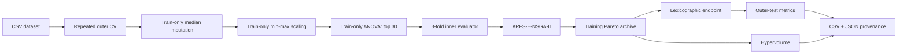

# ARFS-E-NSGA-II

Reproducible research code for **Adaptive Redundancy-Aware Feature Selection with Enhanced Evolutionary Search Based on NSGA-II**.

> Status: public-release candidate. The method, nested evaluation protocol, eight ablations, provenance audit, and checksum-locked preparation of all ten paper datasets are implemented. Third-party data are downloaded locally and are not covered by this repository's MIT license.

## What is implemented



- Three minimization objectives: inner-CV balanced error, selected-feature ratio, and mean pairwise mutual-information redundancy.
- Multi-source initialization: ReliefF, mutual information, chi-square, F-score, and random-forest importance with validation-softmax weights.
- DPIM: archive-relative partitioning, IGD history, relative stagnation detection, and adaptive bidirectional/sparsity-biased mutation.
- DRFM: population monitoring plus one deterministic redundancy–relevance exchange per individual and generation.
- Eight component combinations (`none`, `a`, `b`, `c`, `ab`, `ac`, `bc`, `abc`).
- Repeated nested stratified CV and optional group-aware splitting at both levels.
- Exact three-dimensional hypervolume, fixed reference point `(1.1, 1.1, 1.1)`.
- Machine-readable splits, candidate sets, seeds, diagnostics, archives, environment metadata, and audit report.

## Quick start

Python 3.10+ is required.

```bash
python -m pip install -e .
arfs-ensga2 demo --output results/demo
arfs-ensga2 audit --output results/demo
```

For the exact dependency versions used during verification:

```bash
python -m pip install -r requirements-lock.txt
python -m pip install -e . --no-deps
```

On the development machine for this repository:

```powershell
& 'D:\chatgpt\envs\research\Scripts\python.exe' -m pip install -e .
& 'D:\chatgpt\envs\research\Scripts\python.exe' -m arfs_ensga2.cli demo --output results/demo
```

## Input data

One row represents one expression profile. Feature columns must be numeric.

```text
gene_001,gene_002,...,label,group
5.2,1.7,...,tumor,patient_001
4.8,2.1,...,normal,patient_002
```

- `label` is required by default.
- `group` is optional; set `experiment.group_column: group` for linked samples, matched pairs, patients, or technical replicates.
- Feature columns may contain missing numeric values. Medians are learned from each outer-training fold only.

See [data/README.md](data/README.md) for the expected dataset layout and paper dataset inventory.

Prepare all ten paper datasets:

```bash
arfs-ensga2 prepare-geo --accession all
arfs-ensga2 prepare-legacy --dataset all
```

Each command validates the expected sample/feature/class counts and writes a source/output checksum manifest. Install `openpyxl` (or `pip install -e ".[data]"`) for the 11_Tumor workbook.

Run the proposed method on all ten prepared datasets (this is computationally expensive):

```bash
arfs-ensga2 suite --output results/paper
# Add --ablation to run all eight A/B/C combinations.
```

## Reproduce an experiment

Edit a copy of `configs/default.yaml`, then run:

```bash
arfs-ensga2 run \
  --data data/processed/Colon.csv.gz \
  --config configs/default.yaml \
  --variant abc \
  --output results/colon_abc
```

Run the full component ablation:

```bash
arfs-ensga2 ablation \
  --data data/processed/Colon.csv.gz \
  --config configs/default.yaml \
  --output results/colon_ablation
```

`none` is the common NSGA-II backbone with all three proposed packages disabled. `abc` is the complete proposed method.

## Output contract

| File | Contents |
|---|---|
| `fold_results.csv` | Outer-test metrics, endpoint subset, seed, runtime, evaluation count |
| `archives.csv` | Complete training-side nondominated archives |
| `summary.csv` | Mean and sample standard deviation across outer folds |
| `splits.json` | Outer/inner indices and training-only ANOVA candidate sets |
| `manifest.json` | Input checksum, class counts, missingness, configuration, environment |
| `diagnostics/*.json` | IGD trace, DPIM groups/mutation state, DRFM swaps and monitoring |

## Reproducibility decisions

The manuscript leaves a few implementation details underspecified. This release makes them explicit:

| Item | Implemented decision |
|---|---|
| Feature-ratio denominator | Default is the 30-feature candidate pool, matching the formal objective. Set `feature_ratio_denominator: original` to reproduce the alternative wording in the experiment section. |
| Sparsity-biased mutation | A selected bit is removed on a mutation event; an unselected bit is added with probability 0.25. The paper says “prioritize” but gives no ratio. |
| Initialization validation subset | Top 10 features per source by default (`initialization_top_k`). |
| Ties | Stable order, then smallest feature index. |
| RED estimator | `sklearn.feature_selection.mutual_info_regression` with the run seed and an on-demand symmetric cache. |

These decisions are stored in every result manifest. They should be aligned with the manuscript before a camera-ready release.

## Scope and current limits

- This repository does **not** claim that the manuscript's numerical tables have already been regenerated. Full repeated nested-CV runs remain computational work; every future run records its matrices, splits, seeds, archives, and checksums.
- The eight literature baselines (MOPSO, NSGA-III, HMO-NSGA-II, FTGGA, MMODE, MOMOGS-PCE, and XGBoost-MOGA) are not reimplemented from paper descriptions here. Doing so without their original source would risk silently changing their native operators. The common NSGA-II backbone and all proposed-method ablations are included.
- HSIC Lasso and Block HSIC Lasso are not bundled; their original implementations should be integrated as separately versioned adapters.
- Cross-validation fold results overlap and must not be treated as independent population samples. Dataset-level inference is recommended for the final benchmark analysis.

## Tests

```bash
python -m pytest
```

## Before publishing

- Run the full ten-dataset experiment and archive the generated result manifests.
- Run all datasets, preserve the generated manifests, and compare against the manuscript tables.
- Add verified adapters/commit hashes for every external baseline.
- Replace the generic citation metadata with the final author list, DOI, and repository URL.
- Confirm that the MIT license matches all authors' release decision before pushing publicly.

## License

MIT. Dataset licenses and terms remain with their original providers.

